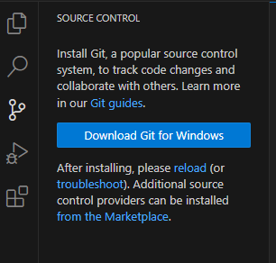
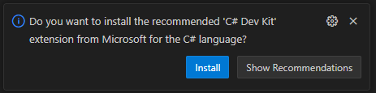
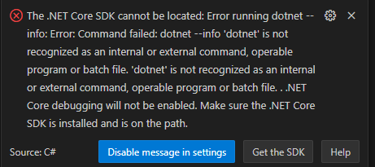
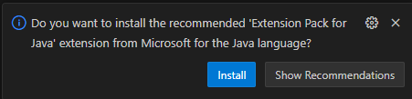

# Instructions for non Java or c# Devs
* Install visual studio code https://code.visualstudio.com/download
* In "Source control" click "Download Git for windows" 

* Clone the repository https://github.com/3Dmondo/KafkaWorkshop
* For c#:
  * In Visual studio code open the file Net/Chat/Program.cs, you will be promped to install the c# Dev kit  
   
  Follow the suggestion and install it.
  * Get the .Net Core SDK when asked to (version 8 is ok) and install it  
  
  * You should now be able to run and debug the application
* For Java:
  * Open the file Java/src/main/java/com/example/chat/Program.java
  * You will be promped to install the reccomended 'Extensioin pack for Java' 
   
  Do it
  * Get the Java Development Kit https://corretto.aws/downloads/latest/amazon-corretto-11-x64-windows-jdk.msi
